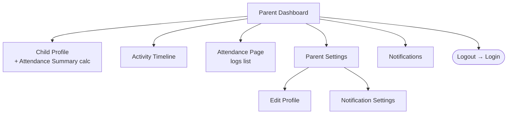
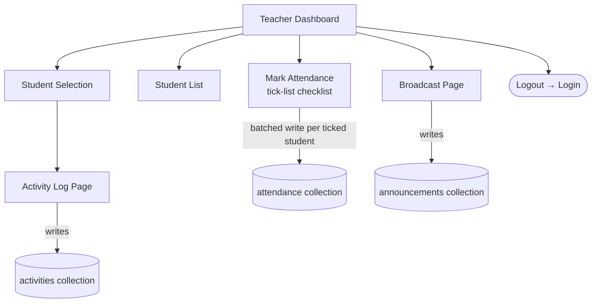
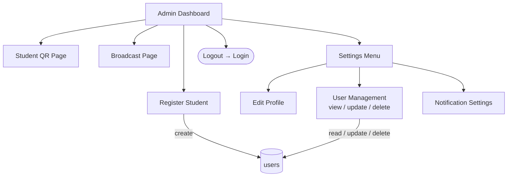
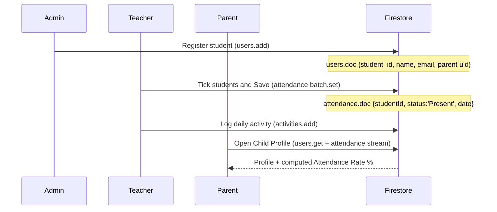

# KindiSync — User Flow Diagrams

Three roles share a single Login screen. Credentials route the user to one of
three home dashboards.

## 1. Top-level routing

```mermaid
flowchart TD
    Start([App launch]) --> Login[Login Page]
    Login -->|admin@kindisync.com| Admin[Admin Dashboard]
    Login -->|teacher@kindisync.com| Teacher[Teacher Dashboard]
    Login -->|valid parent creds| Parent[Parent Dashboard]
    Login -->|invalid| Login
    Login -.->|Forgot Password| Forgot[Forgot Password Page] --> Login
```

## 2. Parent flow (User side)



**Calculation surface:** Parent Dashboard → **Child Profile** → Attendance
Summary card displays Present, Absent, Rate % calculated from the last 30
days of `attendance` documents.

## 3. Teacher flow (Data input side)



Every teacher action writes structured data into Firestore — this is the
"Input data" requirement of the rubric.

## 4. Admin flow (CRUD side)



**Rubric mapping for admin:**

| Rubric item | Screen |
| --- | --- |
| Login (username + password) | Login Page |
| View all input data | User Management (lists all users) |
| Update data | User Management (edit action) |
| Delete data | User Management (delete action) |
| Logout | AppBar logout icon |

## 5. End-to-end happy path



This sequence is the full Input → Calculation → Display Result loop the
rubric asks for, but spread across the three roles instead of one user.
